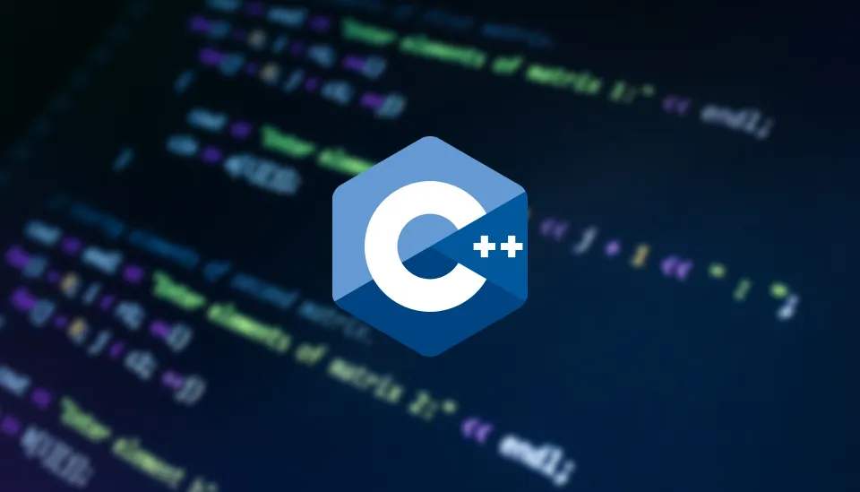

# Segundo-Bimestre-Programación I

# **USO DEL LENGUAJE C++**

"Durante el presente bimestre, se utilizará el lenguaje de programación C++ como herramienta principal para el desarrollo de los contenidos académicos restantes del semestre. Esto incluye la implementación de ejercicios prácticos, proyectos técnicos y la integración de conceptos fundamentales de programación orientada a objetos, estructuras de datos y algoritmos." 

El objetivo es fortalecer las habilidades de resolución de problemas mediante el uso de C++, aplicando conocimientos teóricos en escenarios prácticos relacionados con el área de estudio.


--
# **<center> DEBER DEL LOBITO  </center>**


Un acertijo muy clásico que no se de donde salió originalmente pero se podría basar en un capitulo de Los Simpson cuando Homero intenta llegar a Maggie, al ayudante de santa y el veneno de ratas en un bote al otro lado del río. Ahora se va ha realizar el mismo acertijo pero será en esta ocasión con un: Vikingo que intentara llevar en un bota a la Caperucita, a un lobo y unas uvas.

### Restricciones del problema
1. **El bote solo puede llevar al vikingo y un acompañante (Caperucita, Lobo o Uvas) por viaje.**
2. **Caperucita no puede quedarse sola con el Lobo (la comería).**
3. **Caperucita no puede quedarse sola con las Uvas (se las comería).**
4. **El vikingo puede hacer viajes de ida y vuelta.**

### Enfoque lógico
Simularemos los movimientos paso a paso como una pequeña máquina de estado. Para simplificar, usaremos cadenas de texto que representen la ubicación de cada personaje.

```cpp
#include <iostream>
#include <string>
#include <vector>
#include <algorithm>

using namespace std;

void mostrarEstado(vector<string> ladoIzq, vector<string> ladoDer, string bote) {
    cout << "\nLado Izquierdo: ";
    for (string item : ladoIzq) cout << item << " ";
    cout << "\nLado Derecho: ";
    for (string item : ladoDer) cout << item << " ";
    cout << "\nBote lleva: " << bote << "\n";
    cout << "-------------------------\n";
}

bool verificarPeligro(vector<string> lado) {
    bool hayLobo = find(lado.begin(), lado.end(), "Lobo") != lado.end();
    bool hayCaperucita = find(lado.begin(), lado.end(), "Caperucita") != lado.end();
    bool hayUvas = find(lado.begin(), lado.end(), "Uvas") != lado.end();

    if (hayLobo && hayCaperucita && lado.size() == 2) {
        cout << "¡PELIGRO! El lobo se queda con Caperucita.\n";
        return true;
    }

    if (hayUvas && hayCaperucita && lado.size() == 2) {
        cout << "¡PELIGRO! Caperucita podría comerse las uvas.\n";
        return true;
    }

    return false;
}

int main() {
    vector<string> ladoIzq = {"Caperucita", "Lobo", "Uvas"};
    vector<string> ladoDer;
    string bote;

    cout << "Inicio del cruce del río:\n";

    auto mover = [&](string pasajero, bool alDerecho) {
        if (alDerecho) {
            bote = pasajero;
            mostrarEstado(ladoIzq, ladoDer, bote);
            if (pasajero != "ninguno") {
                ladoIzq.erase(find(ladoIzq.begin(), ladoIzq.end(), pasajero));
                ladoDer.push_back(pasajero);
            }
            bote = "ninguno";
            if (verificarPeligro(ladoIzq)) exit(1);
        } else {
            bote = pasajero;
            mostrarEstado(ladoIzq, ladoDer, bote);
            if (pasajero != "ninguno") {
                ladoDer.erase(find(ladoDer.begin(), ladoDer.end(), pasajero));
                ladoIzq.push_back(pasajero);
            }
            bote = "ninguno";
            if (verificarPeligro(ladoDer)) exit(1);
        }
    };

    mover("Caperucita", true);     // 1. Lleva a Caperucita
    mover("ninguno", false);       // 2. Regresa solo
    mover("Lobo", true);           // 3. Lleva al Lobo
    mover("Caperucita", false);    // 4. Regresa con Caperucita
    mover("Uvas", true);           // 5. Lleva las Uvas
    mover("ninguno", false);       // 6. Regresa solo
    mover("Caperucita", true);     // 7. Lleva a Caperucita
        cout << "\n¡Todos cruzaron con seguridad! 🛶🐺👧🍇\n";
    return 0;
} 
```

###  ¿Qué hace este programa?
- Muestra los movimientos del vikingo paso a paso.
- Cada estado tiene tres partes: lo que hay en la **orilla izquierda**, en la **derecha**, y lo que hay en el **bote**.
- Cada acción respeta las restricciones de seguridad.

---

***<center> Y con todo lo dicho que comience la materia del Segundo Bimestre.  </center>***

---


# **<center> Recursividad  </center>**


La recursividad es una técnica de programación en la que una función se llama a sí misma para resolver un problema. Es especialmente útil cuando el problema puede dividirse en subproblemas más pequeños del mismo tipo.

En C++, cada llamada recursiva se almacena en la pila de ejecución, lo que permite que cada instancia de la función tenga sus propias variables locales. Sin embargo, esto también implica que un mal diseño puede provocar un desbordamiento de pila si no se define correctamente el caso base

**Tipos de recursividad**

| **Tipo de recursividad** |                                               **Descripcíon**                                              |
|:------------------------:|:----------------------------------------------------------------------------------------------------------:|
|        **Directa**       |       La función se llama a sí misma directamente.   Ejemplo:   factorial(n) llama a factorial(n-1).       |
|   **Indirecta o mutua**  | Una función llama a otra, que a su vez la llama de nuevo.   Ejemplo:   A() llama a B(), y B() llama a A(). |

**Componentes esenciales**

- **Caso base:** Una condición que detiene la recursión. Sin él, se produce un stack overflow.
- **Caso recursivo:** Se llamada a la función con parámetros modificados para acercarse al caso base.
- **Pila de ejecución:** Cada llamada se apila en memoria, creando un nuevo contexto de ejecución.

**Ventajas y Desventajas**

|                      **Ventajas**                     	|               **Desventajas**               	|
|:-----------------------------------------------------:	|:-------------------------------------------:	|
|            Códigos mas limpios y elegantes            	| Puede ser menos eficientes que la iteración 	|
| Ideal para problemas como árboles, backtracking, etc. 	|      Riesgo del desbordamiento de pila      	|
|    Facilita la solución de problemas complejos        	|          Mayor consumo de memoria           	|

**Ejemplos**

1) **Factorial de un número**
```cpp
#include <iostream>
using namespace std;
int factorial(int n) {
    if (n <= 1) return 1;         // Caso base
    return n * factorial(n - 1);  // Caso recursivo
}

int main() {
    int num = 5;
    cout << "Factorial de " << num << " es " << factorial(num) << endl;
    return 0;
}
```
Este ejemplo calcula el factorial de un número usando recursividad. La función se llama a sí misma hasta que n es igual a 1.

2) **Serie Fibonacci**

```cpp
int fibonacci(int n) {
    if (n <= 1) return n;
    return fibonacci(n - 1) + fibonacci(n - 2);  
}            
```
Aunque es un ejemplo clásico, esta versión no es eficiente para valores grandes. Se puede mejorar con memorización o programación dinámica.

3) **Potencia de un número**

```cpp
int potencia(int base, int exponente) {
    if (exponente == 0) return 1;
    return base * potencia(base, exponente - 1);
}
```
Calcula la base^exponente de forma recursiva

**Aplicaciones**

- Cálculo de factoriales y Fibonacci
- Búsqueda binaria
- Algoritmos de ordenamiento como QuickSort y MergeSort
- Backtracking (Sudoku, laberintos, combinaciones)
- Procesamiento de estructuras jerárquicas (árboles, directorios)

# **<center> Manejo de las librerías vector, string y fstream  </center>**

# **Librería Vector**


La librería **`vector`** permite trabajar con vectores dinámicos, que son arreglos que pueden cambiar de tamaño automáticamente. Se incluye con:

```cpp
#include <iostream>
#include <vector>
```
**Características**

- Almacena elementos del mismo tipo.
- Permite acceso por índice.
- Se puede redimensionar automáticamente.
- Ofrece métodos como `.push_back()`, `.size()`, `.clear()`, `.erase()`.

**Métodos comunes:**

|      **Función**     	|                 **Descripción**                	|
|:--------------------:	|:------------------------------------------------:	|
| **`push_back(valor)`** 	| Agrega un elemento final                         	|
|    **`pop_back()`**    	| Elimina el último elemento                       	|
|      **`size()`**      	| Devuelve el número del elemento                  	|
|      **`clear()`**     	| Elimina todos los elementos                      	|
|    **`at(indice)`**    	| Accede a un elemento con verificación de límites 	|
| **`begion()` y `end()`** 	| Iteradores para recorrer el vector               	|

**Ejemplo**


```cpp
#include <iostream>
#include <vector>
using namespace std;

int main() {
    vector<int> numeros;
    numeros.push_back(10);
    numeros.push_back(20);
    numeros.push_back(30);

   for (int i = 0; i < numeros.size(); i++) {
        cout << "Elemento " << i << ": " << numeros[i] << endl;
    }
   return 0;
}
```
# **Librería String**

La clase `string` permite manejar cadenas de texto de forma sencilla y segura.

### Inclusión y sintaxis básica

```cpp
#include <string>
```

```cpp
std::string saludo = "Hola, A24YT!";
```
**Características**
- Permite concatenar, comparar, buscar y modificar cadenas.
- Métodos útiles: `.length()`, `.substr()`, `.find()`, `.append()`.

###  Funciones comunes

| Función         | Descripción                              |
|----------------|-------------------------------------------|
| `length()`     | Longitud de la cadena                     |
| `substr()`     | Extrae una subcadena                      |
| `find()`       | Busca una subcadena                       |
| `append()`     | Añade texto al final                      |
| `erase()`      | Elimina parte de la cadena                |

### Ejemplo completo

```cpp
#include <iostream>
#include <string>

int main() {
    std::string nombre = "A24YT";
    std::string mensaje = "Hola, " + nombre + "!";

    std::cout << mensaje << std::endl;

    return 0;
}
```

# **Librería Fstream**

La librería `fstream` permite leer y escribir archivos. Se incluye con:

```cpp
#include <fstream>
```

### Tipos de flujo

| Tipo         | Descripción                              |
|--------------|-------------------------------------------|
| `ifstream`   | Lectura de archivos                       |
| `ofstream`   | Escritura de archivos                     |
| `fstream`    | Lectura y escritura                       |

### Ejemplo de escritura

```cpp
#include <fstream>
#include <string>

int main() {
    std::ofstream archivo("datos.txt");
    archivo << "Hola, A24YT!\n";
    archivo << "Este es un archivo de prueba.\n";
    archivo.close();
    return 0;
}
```

### Ejemplo de lectura

```cpp
#include <fstream>
#include <iostream>
#include <string>

int main() {
    std::ifstream archivo("datos.txt");
    std::string linea;

    while (getline(archivo, linea)) {
        std::cout << linea << std::endl;
    }

    archivo.close();
    return 0;
}
```
# **<center> Punteros  </center>**

Un puntero es una **variable especial** que almacena la dirección de memoria de otra variable. O sea, no guarda un número directamente, sino **dónde vive** ese número en la memoria.

### ¿Cómo se declara un puntero?

```cpp
int* ptr; // Puntero a entero
```

El `*` no significa "multiplicar" acá, significa que `ptr` es un puntero a un `int`. Pero ojo, no estás apuntando a ningún lado todavía.

### Asignarle una dirección

```cpp
int x = 42;
int* ptr = &x; // '&' significa "la dirección de"
```

Ahora `ptr` apunta al lugar en la memoria donde vive `x`. Si accedes con `*ptr`, vas al contenido que está en esa dirección.


### Acceso y manipulación

```cpp
#include <iostream>
using namespace std;

int main() {
    int x = 10;
    int* ptr = &x;

    cout << "Valor de x: " << x << endl;
    cout << "Dirección de x (&x): " << &x << endl;
    cout << "Valor guardado en ptr: " << ptr << endl;
    cout << "Valor al que apunta ptr (*ptr): " << *ptr << endl;

    *ptr = 20; // Cambia el valor de x usando el puntero
    cout << "Nuevo valor de x: " << x << endl;

    return 0;
}
```

### Cosas que podés hacer con punteros

- Cambiar una variable desde otro lugar
- Pasar variables por referencia a funciones
- Crear estructuras dinámicas (listas, árboles)
- Reservar memoria en tiempo de ejecución


### Punteros y funciones

```cpp
void cambiarValor(int* p) {
    *p = 99;
}

int main() {
    int num = 5;
    cambiarValor(&num);
    cout << "Nuevo valor: " << num << endl; // Imprime 99
    return 0;
}
```

Esto se usa mucho para modificar variables dentro de funciones sin necesidad de retornarlas.

### Punteros y arreglos

Un arreglo es una especie de puntero. El nombre del arreglo ya es una dirección.

```cpp
int arr[3] = {10, 20, 30};
int* p = arr;

cout << *p << endl;      // 10
cout << *(p + 1) << endl; // 20
```

`p + 1` te mueve una posición en el arreglo.


###  Memoria dinámica (`new` y `delete`)

Cuando querés reservar memoria sin saber cuántos datos tendrás:

```cpp
int* puntero = new int; // Crea espacio para un entero

*puntero = 123;
cout << *puntero << endl;

delete puntero; // Libera memoria
```

Esto es fundamental para listas dinámicas y estructuras como grafos.

### Peligros clásicos

- Acceso a memoria no inicializada
- Olvidar liberar con `delete` → fuga de memoria
- Punteros colgantes (apuntar a memoria ya liberada)

### Analogía final

Pensá que la RAM es como una ciudad, las variables son casas, y los punteros son direcciones en tu GPS. Vos podés modificar una casa, visitar otra, o hasta construir una nueva todo dependiendo de cómo uses el GPS.

# **<center> Colas - Pilas - Listas  </center>**

### **1. Pilas (Stacks)**

Las pilas siguen el principio LIFO (Last In, First Out). Se usan en cálculo simbólico, sistemas de ecuaciones, y recorridos de árboles.
###  Teoría
- Estructura LIFO (Last In, First Out)
- Operaciones principales:
  - `push(x)` – agrega `x` a la cima.
  - `pop()` – elimina el elemento superior.
  - `top()` – consulta el elemento superior.
  - `empty()` – verifica si está vacía.

### Ejemplo extendido

```cpp
#include <iostream>
#include <stack>
using namespace std;

void mostrarPila(stack<int> s) {
    cout << "Contenido de la pila: ";
    while (!s.empty()) {
        cout << s.top() << " ";
        s.pop();
    }
    cout << endl;
}

int main() {
    stack<int> pila;

    for (int i = 1; i <= 5; ++i)
        pila.push(i * 10); // 10, 20, ..., 50

    cout << "Top actual: " << pila.top() << endl;
    pila.pop();
    cout << "Después de pop(), nuevo top: " << pila.top() << endl;

    mostrarPila(pila);

    return 0;
}
```

### Aplicaciones:
- Recorrido DFS en grafos
- Validación de paréntesis
- Control de estados en simuladores físicos
- Historial de acciones (como en editores)

### **2. Colas (Queues)**

Las colas siguen el principio FIFO (First In, First Out). Se usan en simulación de procesos, física computacional para eventos temporales o buffers de entrada/salida

###  Teoría
- Estructura FIFO (First In, First Out)
- Operaciones principales:
  - `push(x)` – agrega `x` al final.
  - `pop()` – elimina el primer elemento.
  - `front()` – consulta el primero.
  - `back()` – consulta el último.
  - `empty()` – verifica si está vacía.

### Ejemplo extendido

```cpp
#include <iostream>
#include <queue>
using namespace std;

void procesarCola(queue<string> cola) {
    while (!cola.empty()) {
        cout << "Procesando: " << cola.front() << endl;
        cola.pop();
    }
}

int main() {
    queue<string> cola;

    cola.push("Evento A");
    cola.push("Evento B");
    cola.push("Evento C");

    cout << "Inicio de la cola: " << cola.front() << endl;
    cout << "Fin de la cola: " << cola.back() << endl;

    cola.pop(); // Elimina "Evento A"
    cout << "Nuevo inicio tras pop(): " << cola.front() << endl;

    procesarCola(cola);

    return 0;
}
```

###  Aplicaciones:
- Simulación de colas de clientes o eventos
- Sistemas operativos: planificación de procesos
- Buffers de entrada/salida
- Algoritmos BFS (breadth-first search)


### **3. Listas Doblemente Enlazadas (`std::list`)**

Las listas permiten inserciones eficientes en cualquier punto y se usan en simulaciones físicas, resolución de sistemas dinámicos y estructuras de datos personalizadas.

### Teoría
- Punteros bidireccionales entre nodos
- Inserciones y eliminaciones eficientes en cualquier parte
- No tienen acceso aleatorio como `vector`
- Métodos: `push_back`, `push_front`, `insert`, `erase`, `pop_back`, `pop_front`

### Ejemplo extendido

```cpp
#include <iostream>
#include <list>
using namespace std;

void mostrarLista(const list<int>& lista) {
    for (int num : lista)
        cout << num << " ";
    cout << endl;
}

int main() {
    list<int> lista = {1, 2, 3, 4};

    lista.push_front(0); // {0, 1, 2, 3, 4}
    lista.push_back(5);  // {0, 1, 2, 3, 4, 5}

    auto it = lista.begin();
    advance(it, 3); // Apunta al cuarto elemento
    lista.insert(it, 99); // Inserta 99 antes de 3

    cout << "Lista actual: ";
    mostrarLista(lista);

    lista.remove(2); // Elimina todos los elementos que valen 2
    cout << "Tras remover 2: ";
    mostrarLista(lista);

    return 0;
}
```

### Aplicaciones:
- Simulación de trayectorias físicas con nodos
- Colisiones y secuencias de eventos
- Sistemas de edición dinámicos
- Modelos de redes conectadas


### Comparación Técnica

| Estructura | Inserción | Eliminación | Orden | Acceso Aleatorio | Ideal Para |
|------------|-----------|-------------|--------|------------------|-------------|
| Pila       | Tope      | Tope        | LIFO   | ❌               | Recursión, control de estados |
| Cola       | Final     | Inicio      | FIFO   | ❌               | Simulaciones, planificación |
| Lista      | Cualquier | Cualquier   | Secuencial | ❌           | Trayectorias, edición, grafos |

# **<center> Árboles binarios y Gestión de errores  </center>**


### Árboles Binarios en C++

Un **árbol binario** es una estructura de datos jerárquica donde cada nodo tiene hasta dos hijos: izquierdo y derecho. Se usa muchísimo para búsquedas rápidas, ordenamientos y estructuras como árboles de expresión.

### Definición básica

```cpp
struct Nodo {
    int dato;
    Nodo* izquierda;
    Nodo* derecha;

    Nodo(int valor) : dato(valor), izquierda(nullptr), derecha(nullptr) {}
};
```

### Insertar elementos

```cpp
Nodo* insertar(Nodo* raiz, int valor) {
    if (raiz == nullptr)
        return new Nodo(valor);

    if (valor < raiz->dato)
        raiz->izquierda = insertar(raiz->izquierda, valor);
    else
        raiz->derecha = insertar(raiz->derecha, valor);

    return raiz;
}
```

### Recorrido en orden (in-order)

```cpp
void inOrden(Nodo* raiz) {
    if (raiz != nullptr) {
        inOrden(raiz->izquierda);
        cout << raiz->dato << " ";
        inOrden(raiz->derecha);
    }
}
```

### Uso básico en `main`

```cpp
int main() {
    Nodo* raiz = nullptr;
    raiz = insertar(raiz, 8);
    insertar(raiz, 3);
    insertar(raiz, 10);
    insertar(raiz, 1);
    insertar(raiz, 6);

    cout << "Recorrido inOrden: ";
    inOrden(raiz);

    return 0;
}
```

### Gestión de Errores en C++

En C++, podemos controlar errores usando **excepciones**: bloques `try`, `catch` y `throw`.

### Ejemplo básico

```cpp
#include <iostream>
using namespace std;

int dividir(int a, int b) {
    if (b == 0)
        throw runtime_error("Error: división por cero");
    return a / b;
}

int main() {
    try {
        int resultado = dividir(10, 0);
        cout << "Resultado: " << resultado << endl;
    } catch (const exception& e) {
        cout << "Excepción capturada: " << e.what() << endl;
    }

    return 0;
}
```

### Puedes capturar distintos tipos de excepciones

```cpp
try {
    // Código que puede fallar
} catch (const runtime_error& e) {
    cout << "Runtime error: " << e.what() << endl;
} catch (const exception& e) {
    cout << "Excepción general: " << e.what() << endl;
}
```

### Conexión práctica

- Los árboles binarios son ideales para representar jerarquías o realizar búsquedas más eficientes que un arreglo.
- La gestión de errores te salva de que el programa crashee por situaciones previsibles (como divisiones por cero, acceso a memoria, archivos faltantes, etc.).


